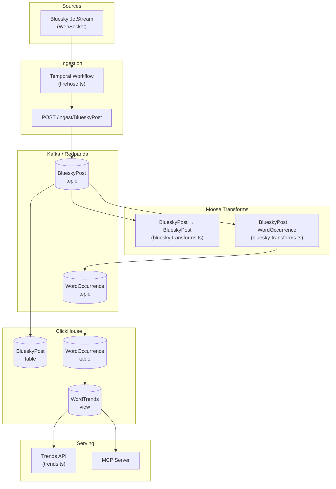

# MooseSky - Bluesky Firehose Word Trends

A real-time word trends application that ingests the Bluesky firehose and analyzes trending words.

Built with [Moose](https://docs.fiveonefour.com/moose) and [Temporal](https://temporal.io/).

## Prerequisites

- [Devbox](https://www.jetify.com/devbox) installed
- Docker running

## Getting Started

### 1. Install Dependencies

```bash
# Enter the devbox shell
devbox shell

# Install dependencies for all packages
pnpm install
```

### 2. Set Up Environment Variables

Copy example environment variable files:

```bash
cp packages/moosestack-service/.env.example packages/moosestack-service/.env.local
cp packages/web-app/.env.example packages/web-app/.env.local
```

Create API Key authentication tokens:

```bash
cd packages/moosestack-service
moose generate hash-token
```

This will output two values:
- **ENV API Key**: Use this for the MooseStack service
- **Bearer Token**: Use this for the web app

Set environment variables:

1. **Set your API Key** in `packages/moosestack-service/.env.local`:
   - Set `MCP_API_KEY` to the **ENV API Key** generated by `moose generate hash-token`

2. **Set your API Token** in `packages/web-app/.env.local`:
   - Set `MCP_API_TOKEN` to the **Bearer Token** generated by `moose generate hash-token`

3. **Set your Anthropic API key** in `packages/web-app/.env.local`:
   - Set `ANTHROPIC_API_KEY` to your Anthropic API key (get one from https://console.anthropic.com/)

### 3. Start the Moose Service

The Moose service provides the backend data pipeline, APIs, and infrastructure (ClickHouse, Redpanda, Redis, Temporal).

```bash
# From the project root (inside devbox shell)
pnpm dev:moose

# Or from the moosestack-service directory:
cd packages/moosestack-service
pnpm dev
```

The Moose service will start on **http://localhost:4000** and includes:
- ClickHouse (port 18123)
- Redpanda/Kafka (port 19092)
- Redis (port 6379)
- Temporal (port 7233)
- Temporal UI (port 8080)

### 4. Start the Next.js Web App

In a separate terminal (inside devbox shell):

```bash
# From the project root
pnpm dev:web

# Or from the web-app directory:
cd packages/web-app
pnpm dev
```

The Next.js app will start on **http://localhost:3000** and provides:
- Dashboard UI for viewing trending words
- AI chat interface with MCP integration

### 5. Run the Firehose Workflow

Once moose is running, start the firehose ingestion workflow:

```bash
# In a separate terminal (inside devbox shell)
moose-cli workflow run firehose
```

The workflow will:
- Connect to Bluesky's JetStream firehose
- Ingest posts into Kafka/Redpanda
- Transform posts to extract word occurrences
- Store data in ClickHouse for analysis

### 6. View the Dashboard

Open **http://localhost:3000** in your browser to see the dashboard with trending words.

The dashboard includes:
- Real-time trending words visualization
- Word comparison charts
- AI chat interface for querying data
- Statistics and analytics

**Note:** Make sure both the Moose service (port 4000) and Next.js app (port 3000) are running.

#### Starting Both Services Together

You can also start both services simultaneously from the project root:

```bash
pnpm dev
```

This will start both the Moose service and Next.js app in parallel.

### 7. Stop the Workflow

#### Via CLI (Recommended)

```bash
# Cancel the firehose workflow from the command line
moose-cli workflow cancel firehose
```

#### Via Temporal UI

You can also stop the workflow from the Temporal UI at http://localhost:8080:
1. Find the `firehose` workflow
2. Click "Terminate" or "Cancel"

## Cleaning/Resetting Data

### Using Moose Truncate (Recommended)

**⚠️ Warning:** This will permanently delete all data from all tables. This action cannot be undone.

The easiest way to clean up all data:

```bash
# Truncate all tables (clears all data from ClickHouse)
moose truncate --all
```

This will clear all data from ClickHouse tables while keeping the infrastructure running. For more options (like deleting specific tables or the last N rows), see the [Moose CLI documentation](https://docs.fiveonefour.com/moosestack/moose-cli?lang=typescript#truncate).

### Using Moose Clean (Alternative)

To clear temporary data and stop development infrastructure:

```bash
moose clean
```

This stops Docker containers and clears temporary data, but preserves volumes.

### Complete Reset (Docker Containers & Volumes)

To completely reset everything including all Docker containers and volumes:

```bash
# Stop moose first
# Press Ctrl+C if moose dev is running, or:
moose workflow cancel firehose

# Stop and remove all Docker containers and volumes
docker-compose down -v

# Or if using docker directly, remove moose-related containers:
docker ps -a | grep moose | awk '{print $1}' | xargs docker rm -f
docker volume ls | grep moose | awk '{print $2}' | xargs docker volume rm

# Then restart moose
moose dev
```

**Note:** This will completely remove all data, containers, and volumes. You'll need to restart the workflow after this.

## Architecture



## Configuration

### Ports

| Service | Port |
|---------|------|
| Next.js Web App | 3000 |
| Moose HTTP | 4000 |
| ClickHouse HTTP | 18123 |
| Redpanda/Kafka | 19092 |
| Redis | 6379 |
| Temporal | 7233 |
| Temporal UI | 8080 |

### Key Settings

- Moose service configuration: `packages/moosestack-service/moose.config.toml`
- Next.js configuration: `packages/web-app/next.config.ts`
- Environment variables: See `.env.example` files in each package directory

## Acknowledgments

This project was inspired by [BlueHoover](https://github.com/JosephRedfern/bluehoover) by Joe Redfern.

## License

MIT
